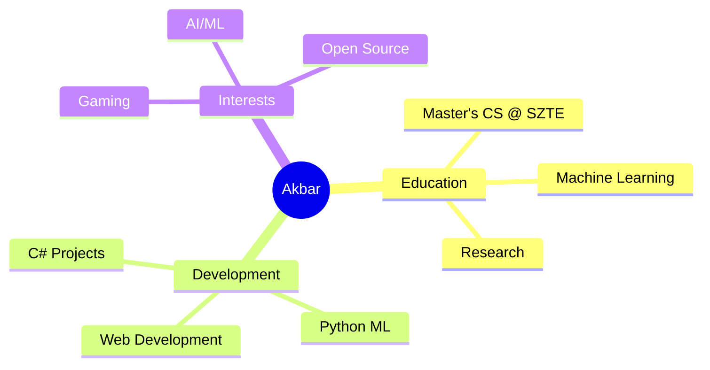

<div align="center">

# 👋 Welcome to my Digital Universe!


[](https://linkedin.com/in/zarasoft)
[](https://github.com/Akbar2998)
[](https://twitter.com/onesm1le)


</div>

---

## 🚀 About Me

```python
class AkbarMakhmanazarov:
    def __init__(self):
        self.username = "Akbar2998"
        self.name = "Akbar Makhmanazarov"
        self.location = "Szeged, Hungary 🇭🇺"
        self.education = "Master's in Computer Science @ SZTE"
        self.current_focus = ["Machine Learning", "C#", "Python"]
        self.interests = ["AI/ML", "Software Development", "Gaming"]
        self.motto = "Playing games more than coding, but loving both! 🎮💻"

    def say_hi(self):
        print("Thanks for dropping by! Let's build something awesome together!")

me = AkbarMakhmanazarov()
me.say_hi()
```

---

## 🛠️ Tech Stack & Tools

### 💻 Languages


### 🤖 Machine Learning & AI


### 🔧 Tools & Technologies


---

## 📊 GitHub Analytics

<div align="center">


</div>

<div align="center">

[](https://git.io/streak-stats)

</div>

<div align="center">

[](https://github.com/ashutosh00710/github-readme-activity-graph)

</div>

---

## 🏆 GitHub Trophies

<div align="center">

[](https://github.com/ryo-ma/github-profile-trophy)

</div>

---

## 📌 Featured Projects

<div align="center">

[](https://github.com/Akbar2998/Animal-Trading-Card)
[](https://github.com/Akbar2998/AI-start-Stepik)

[](https://github.com/Akbar2998/sirius)
[](https://github.com/Akbar2998/kurant)

</div>

---

## 🎯 Current Focus



- 🔭 Working on: **C# Development Projects**
- 🌱 Learning: **Machine Learning & Advanced Python**
- 🎮 Hobby: **Gaming & Tech Exploration**
- 🎓 Studying: **Computer Science at University of Szeged**
- 📍 Based in: **Szeged, Hungary**

---

## 💭 Random Dev Quote

<div align="center">


</div>

---

## 🐍 Contribution Snake

<div align="center">


</div>

---

## 📫 Let's Connect!

<div align="center">

I'm always open to interesting conversations and collaboration opportunities!

[](https://linkedin.com/in/zarasoft)
[](https://github.com/Akbar2998)
[](https://twitter.com/onesm1le)

### ⭐ From [Akbar2998](https://github.com/Akbar2998) with ❤️


</div>
